<div align="center">

# 🐣 Hatch — Headless WordPress, made easy

**One plugin + one Astro starter + a 1-click deploy broker. Ship a fast, vendor-neutral headless site in an afternoon.**

Paste a Cloudflare Workers or Vercel token, click Build & Deploy, watch a ~90-second build, get a live `*.workers.dev` or `*.vercel.app` URL. No GitHub fork on your account. No GraphQL. No vendor lock-in. WordPress stays exactly where it is — the editor unchanged, the REST API hardened, frontend rendered on a global edge CDN.

[](#install-the-plugin)
[](LICENSE)
[](https://astro.build)
[](https://wordpress.org)
[](https://github.com/adityaarsharma/hatch/releases/latest)

<br/>

<!-- HATCH_DOWNLOAD_BADGE — auto-resolves to whatever is tagged "latest" on GitHub.
     Update the version label below at every release (CLAUDE.md guardrail #9). -->
### 📦 [**Download Hatch v0.25.0 (latest) →**](https://github.com/adityaarsharma/hatch/releases/latest/download/hatch.zip)

_Drop into `wp-content/plugins/`. Activate. The wizard auto-launches. Done in 4 steps._

<br/>

[Why this is different](#why-this-is-different) · [What's inside](#whats-inside) · [Install](#install-the-plugin) · [How it works](#how-it-works) · [vs. alternatives](#hatch-vs-everyone-else) · [FAQ](#faq)

**👋 New to headless WordPress?** [Plain-English explainer →](docs/what-is-headless-wordpress.md)

</div>

---

## Why this is different

Every headless WordPress option in 2026 ships ONE thing.

- **Faust.js** ships a Next.js framework. You still need a security plugin, a GraphQL plugin, an SEO bridge, a forms bridge.
- **gatsby-source-wordpress** ships a Gatsby data source. Same — bring your own everything else.
- **HeadstartWP** (10up) ships a React framework. Still bring everything else.
- **DIY with REST** takes 3 weeks the first time, and the moment ACF, RankMath, or a CPT misbehaves you're alone.

**Hatch ships the whole stack as a single WordPress plugin.**

```
One plugin includes:
  ├─ Premium wp-admin design system (Linear-grade, scoped CSS, Inter font)
  ├─ 12-point preflight diagnostic that catches every common headless pitfall
  ├─ 4-step setup wizard that auto-launches on first activation
  ├─ App Password generator with copy-to-clipboard .env block
  ├─ Auto-bridge for RankMath / Yoast / ACF / Meta Box / WPForms / Fluent /
     Gravity / CF7 / Polylang / WPML / Pods / CPT UI (24 detected plugins)
  ├─ 8 headless-first Gutenberg blocks (Tailwind utility output, static save)
  ├─ Custom Code Block with 3 security modes (admin-only HTML/CSS/JS)
  ├─ 14 toggleable frontend features (TOC, share sidebar, related posts,
     breadcrumb, author bio, reading time, schema flow, sitemap merge…)
  ├─ Security: REST hardening, custom login URL, brute-force lockout,
     headless role guard, root-domain detection
  ├─ 6 WP-CLI commands for terminal users
  └─ Premium-feel everywhere — buttons, cards, status rows, icons, animations
```

**No competitor bundles this.** This is the difference between "framework + 8 dependencies" and "click install, done."

---

## What's inside

The plugin opens with **4 centered tabs** that match the onboarding aesthetic. Everything is scoped — zero pollution of wp-admin or other plugins.

### 🔌 Connector — the home tab

- **Connection status** at a glance
- **12-point preflight diagnostic** (WP/PHP versions, permalinks, HTTPS, REST API reachable + authenticated, App Passwords available, blocking plugins detected, cache plugins flagged, ACF + CPT REST exposure, webhook configured)
- **Your Headless Website URL** input — one field, one button labeled "Connect Hatch"
- **Frontend credentials block** with copy-to-clipboard `.env` (WP URL, user, App Password, webhook secret)
- **Three hosting options** with clear deploy guides (Cloudflare Pages — recommended · Vercel · your own VPS with RunCloud)

### ✨ Features — toggle the frontend

14 SproutOS-blog-grade features, each toggleable. Your Astro frontend reads `/wp-json/hatch/v1/features` at build time and respects the toggles.

```
Reading experience      Post navigation       Author + Archives    SEO + Schema
────────────────────    ─────────────────     ──────────────────   ──────────────
□ Reading progress bar  □ Next/Prev nav       □ Author bio         □ Schema flow (RankMath/Yoast)
□ Sticky share sidebar  □ Related posts       □ Author archives    □ Merged sitemap
□ Table of Contents                            □ Category archives
□ Breadcrumb                                  □ Category tabs +
□ Word count + reading                          Load More
□ Last updated date
```

Plus theme picker: **Blog · Tech · Docs** — switchable anytime.

### 🧱 Blocks — control your editor

8 headless-first Gutenberg blocks with individual enable/disable toggles + master switch:

**Section · Container · Heading · Paragraph · Button · Image · Hero · Custom Code**

Every block saves **static HTML with Tailwind utility classes**. Zero PHP at render time. Works on any frontend that can render HTML.

The **Custom Code Block** is the answer to "headless is boring":

| Mode | What runs | Use for |
|---|---|---|
| **Inline** (default) | HTML + scoped CSS | Marquees, neon text, glassmorphism, CSS animations |
| **Shadow DOM** | HTML + CSS + JS in `<hatch-shadow-code>` | Interactive widgets you trust |
| **Iframe** | Sandboxed `<iframe>` | Third-party embeds |

Ships with 8 pre-loaded snippets — animated gradient, smooth marquee, glassmorphism card, neon glow, typewriter, scroll parallax, 3D card flip, particle canvas.

### 🛡 Security — hardened by default

- REST API blocked for anonymous users (401)
- `/wp/v2/users` endpoint removed
- `?author=N` enumeration killed
- XML-RPC disabled
- Custom login URL with WPS-Hide-Login pattern (2M-install precedent)
- Brute-force IP lockout (hashed IPs, not stored raw)
- Headless role guard kicks subscribers/customers out of wp-admin
- Force-noindex site-wide

---

## Install + deploy

### 1. Download the plugin

> **[hatch.zip — v0.25.0 (latest)](https://github.com/adityaarsharma/hatch/releases/latest/download/hatch.zip)**

WordPress admin → **Plugins → Add New → Upload Plugin** → choose `hatch.zip` → **Activate**. Setup wizard auto-launches.

### 2. Wizard → step 3 → pick a host

- **⚡ Cloudflare Workers** (recommended, free, unlimited bandwidth) — paste a `Workers Scripts: Edit` API token
- **▲ Vercel** — paste a Vercel access token (Full Account scope, 1-day expiry is fine)
- **🖥 Your VPS** — one curl command, no token needed

### 3. Click "Build & deploy"

A new tab opens with a live build log (terminal aesthetic). ~90 seconds later you have a live `*.workers.dev` or `*.vercel.app` URL serving your WordPress content with SSR + edge cache. **No GitHub fork on your account.** Token used once and dropped from memory.

### After the deploy

- New WP posts go live within ~60 seconds via the edge cache TTL — no rebuild needed
- Toggle features in Plugin → Features tab → frontend reflects within 60 seconds via the `/hatch/v1/features` endpoint
- Re-deploys only needed when the Astro starter code itself updates (rare)

### Terminal install (alternative)

```bash
cd /var/www/your-wp-site/wp-content/plugins
wget https://github.com/adityaarsharma/hatch/releases/latest/download/hatch.zip
unzip hatch.zip && rm hatch.zip
wp plugin activate hatch
```

---

## Requirements

- WordPress **6.4+** (tested up to 6.9)
- PHP **7.4+** (PHP 8.2+ recommended)
- An Astro frontend (Hatch is Astro-first — the bundled starter ships ready to deploy)
- **Strong recommendation:** install WordPress on a **subdomain you control** (e.g. `cms.yoursite.com`), not your root domain. Hatch detects root-domain installs and warns you on activation.

---

## How it works

```mermaid
%%{init: {"theme":"base","themeVariables":{"primaryColor":"#dbeafe","primaryTextColor":"#0f172a","primaryBorderColor":"#2563eb","lineColor":"#64748b","fontSize":"14px"}}}%%
flowchart LR
    Editor("✏️ Editor"):::neutral
    WordPress["🐣 WordPress + Hatch<br/>━━━━━━━━━━━━━<br/>your-cms.example.com<br/>(non-public)"]:::backend
    REST["REST API<br/>+ App Password"]:::api
    Frontend["⚡ Astro frontend<br/>━━━━━━━━━━━━━<br/>example.com<br/>(your visitors)"]:::frontend
    Visitor("👤 Visitor"):::neutral

    Editor -->|writes posts in Gutenberg<br/>using Hatch Blocks| WordPress
    WordPress -->|exposes content + features| REST
    REST -->|fetched at build/request time| Frontend
    Frontend -->|serves pre-rendered HTML| Visitor
    WordPress -.->|webhook on post save| Frontend

    classDef neutral fill:#f1f5f9,stroke:#cbd5e1,color:#0f172a
    classDef backend fill:#fef3c7,stroke:#f59e0b,color:#78350f
    classDef api     fill:#dbeafe,stroke:#2563eb,color:#1e40af
    classDef frontend fill:#d1fae5,stroke:#10b981,color:#065f46
```



Editors keep using WordPress like normal. The frontend lives wherever you want and reads from WordPress via REST. When a post is saved, Hatch fires a webhook to your frontend so it can rebuild affected pages.

---

## Hatch vs everyone else

| | **Hatch** | Faust.js | gatsby-source-wordpress | HeadstartWP (10up) | DIY |
|---|---|---|---|---|---|
| Single plugin install | ✅ | ❌ npm + WPE Atlas | ❌ npm + WPGraphQL | ❌ npm framework | n/a |
| Works with Astro | ✅ | ❌ Next.js only | Possible (no support) | ❌ Next.js only | manual |
| Works without GraphQL | ✅ REST-native | ❌ requires WPGraphQL | ❌ requires WPGraphQL | ✅ REST-native | manual |
| Vendor-neutral hosting | ✅ | ❌ WP Engine push | ❌ Netlify-aligned | ⚠️ 10up-aligned | manual |
| Premium wp-admin UI | ✅ | ❌ no admin UI | ❌ no admin UI | ❌ no admin UI | n/a |
| Setup wizard inside WordPress | ✅ 4-step + diagnostic | ❌ | ❌ | ❌ | manual |
| 12-point preflight diagnostic | ✅ | ❌ | ❌ | ❌ | manual |
| Headless-first Gutenberg blocks | ✅ 8 blocks | ❌ | ❌ | ❌ | manual |
| Feature toggles (TOC / share / etc.) | ✅ 14 toggles | ❌ | ❌ | ❌ | manual |
| Custom Code Block (3 security modes) | ✅ | ❌ | ❌ | ❌ | manual |
| WP-CLI commands | ✅ 6 commands | ❌ | ❌ | ❌ | n/a |
| Phone-home to vendor | ❌ never | ⚠️ WP Engine | ⚠️ Netlify | ⚠️ 10up | n/a |
| License | MIT | MIT | MIT | MIT | n/a |
| Status (May 2026) | ✅ Active | ⚠️ Pivoting | ⚠️ Maintenance | ✅ Active | n/a |

---

## What ships in the box (the dense version)

For people who want the full surface:

**REST API surface** — everything under `/wp-json/hatch/v1/*`:

```
GET  /info                 → site metadata + plugin detection report
GET  /seo-head?url=…       → RankMath OR Yoast getHead proxy (auto-detects)
GET  /redirects            → merged from RankMath + Redirection plugin
GET  /forms                → list all forms (WPForms/Fluent/Gravity/CF7)
POST /forms/{id}/submit    → submit a form (public, behind Turnstile)
GET  /features             → read all 14 feature toggles + theme (public, no auth)
GET  /diagnostic           → 12-point preflight (admin-only)
GET  /cpt-health           → CPT REST exposure scan (admin-only)
GET  /acf-status           → ACF/Meta Box field group status (admin-only)
POST /revalidate           → manual webhook fire (admin-only)
POST /app-password         → generate App Password programmatically (admin-only)
```

**WP-CLI commands:**

```bash
wp hatch setup --frontend=https://mysite.com   # full setup in one command
wp hatch diagnose                              # 12 checks, exit 1 on fail
wp hatch generate-token                        # App Password only
wp hatch info                                  # detection report
wp hatch revalidate                            # fire webhook
wp hatch env                                   # print .env block
```

**Premium wp-admin features:**

- Inter font from rsms.me (~7KB cached)
- 9 semantic color tokens matching the Astro starter's `--hatch-*` CSS variables
- Heroicons inlined as SVG strings (no extra HTTP requests)
- All CSS scoped to `.hatch-admin` (zero pollution of wp-admin or other plugins)
- 5-breakpoint responsive — works on mobile wp-admin
- Smooth transitions, focus rings, hover lifts — feels like Linear, not 2014 wp-admin

---

## FAQ

<details>
<summary><strong>What does Hatch actually replace?</strong></summary>

For headless WordPress projects, Hatch replaces:
- Faust.js (and the WP Engine + WPGraphQL stack it requires)
- WPGraphQL + WPGraphQL for ACF + WPGraphQL Yoast SEO + their CORS plugins
- The "DIY headless boilerplate" you'd otherwise build from scratch
- The 5–8 separate WordPress plugins you'd normally need to harden + bridge a headless site

For traditional WordPress sites, **Hatch doesn't replace anything** — keep using your page builder, your theme, your existing setup. Hatch only makes sense if you're going headless.

</details>

<details>
<summary><strong>Do I need to run any of my own infrastructure?</strong></summary>

No. Hatch is a single WordPress plugin. You install it on your own WordPress host. There's no Hatch Cloud (yet), no central server, no telemetry, no phone-home. Hatch never calls Aditya's servers — everything happens on your machines.

</details>

<details>
<summary><strong>Can I use this with my existing WordPress site?</strong></summary>

Yes, with one important caveat: **WordPress should be on a non-public subdomain** (e.g. `cms.yoursite.com`), not your root. Hatch detects root-domain installs and shows a warning with a migration guide. The migration is straightforward but should happen before you go live with a headless frontend.

</details>

<details>
<summary><strong>Will it work with my Elementor / Divi / page builder site?</strong></summary>

**No.** Page builders are frontend renderers — their output depends on PHP runtime that doesn't exist in a headless setup. For Elementor/Divi/Beaver Builder sites: keep them as traditional WordPress. For headless: use Hatch's 8 blocks or build your own Astro components.

</details>

<details>
<summary><strong>What about WPGraphQL?</strong></summary>

You can install WPGraphQL alongside Hatch — they don't conflict. But Hatch doesn't require WPGraphQL and never will. The entire REST surface (`/hatch/v1/*` + `/wp/v2/*`) gives your frontend everything it needs.

</details>

<details>
<summary><strong>How do I push updates to my frontend?</strong></summary>

Three options:
1. **Webhook** — when you publish/update a post in WordPress, Hatch fires a POST to your frontend's `/api/revalidate`. Your frontend rebuilds affected pages.
2. **Manual revalidate** — Connector tab → "Test webhook" forces a rebuild ping.
3. **CI/CD** — GitHub Actions / Vercel auto-deploys / Cloudflare Pages deploy hooks can listen for the webhook independently.

For deeper push-from-WordPress workflows (run `git pull && npm build && pm2 reload` on a VPS from the WP admin), see the Hatch Agent docs — opt-in advanced feature for VPS users.

</details>

<details>
<summary><strong>Is the Custom Code Block safe?</strong></summary>

Three layers of defense. Only users with `unfiltered_html` capability can save raw HTML/CSS/JS (default: administrators only). Lower-privileged saves are silently stripped. REST output to non-capable users also strips custom-code blocks. And three execution modes (inline / shadow DOM / iframe sandbox) let you choose per-block.

</details>

<details>
<summary><strong>How does Hatch make money?</strong></summary>

The plugin is MIT-licensed and forever free. [Aditya Sharma](https://adityaarsharma.com/connect) is available for headless WordPress migrations and custom work. A hosted Hatch Cloud is on the long-term roadmap (V2.5+) but only if there's clear demand — the OSS plugin will always be free.

</details>

<details>
<summary><strong>What happens when I delete the plugin?</strong></summary>

The uninstall hook removes **all** `hatch_*` options — webhook secret, agent credentials, security settings, feature toggles, block states, theme choice. Clean removal. No orphaned data. Posts that used Hatch blocks keep their saved HTML — they just appear as "invalid block" until you convert them to plain HTML or reinstall the plugin.

</details>

<details>
<summary><strong>What about CORS?</strong></summary>

For 95% of headless sites, **CORS doesn't apply** — your build process fetches WordPress server-to-server. CORS only matters if you make client-side `fetch()` calls from the browser to WordPress. See [docs/client-side-fetching.md](docs/client-side-fetching.md) for the rare case where you actually need it.

</details>

---

## Roadmap — what's shipped + what's next

| Version | What ships | Status |
|---|---|---|
| v0.1–v0.6 | REST hardening, SEO + forms bridges, ACF/CPT detection, login hardening, App Password helper, 8 Gutenberg blocks, premium admin, 4-tab wizard, 14 feature toggles | ✅ Shipped |
| v0.15–v0.16 | SSR mode (Astro `output: 'server'`), broker-side build pipeline, edge cache | ✅ Shipped |
| v0.17–v0.20 | 1-click deploy pipelines: Vercel + Cloudflare Workers via broker, no GitHub fork, token-in-WP architecture | ✅ Shipped |
| v0.21 | Blog theme polished (Vercel/Linear aesthetic), WP Pages routing, static-front-page support, full feature-toggle live sync, /hatch/v1/features extended with site + home + cpts | ✅ Shipped |
| v0.22 | Integrations tab (SEO auto-detect: Yoast/Rank Math/SEOPress/AIOSEO), headless Comments + Turnstile, Form block (Fluent Forms / WPForms / FluentCRM), Hatch Companion WP theme, "Built by Hatch" footer credit (toggleable) | ✅ Shipped |
| **v0.23** | **Design.md — paste a single Markdown file, your fonts + colors + density flow to the frontend as CSS vars (no rebuild, no AI). Tech theme (Astro Cactus base, MIT). Docs theme (Starlight base, MIT). Forms guide. Docker Node 18 build env for Gutenberg blocks.** | ✅ Current |
| v0.24 | CPT auto-routing — Astro generates dynamic `/[cpt]/[slug]` routes from registered CPTs | 🔵 Planned |
| v0.27 | SEO parity audit — RankMath + Yoast schema graph passthrough verified (Article / Person / BreadcrumbList / FAQ / HowTo / Product), sitemap merge | 🔵 Planned |
| v0.28 | Modular plugin architecture — each major feature as a toggleable module with self-contained admin UI | 🔵 Planned |
| v0.30 | Header / Footer / Custom Page builder — user designs site chrome from WP, frontend reflects | 🔵 Planned |
| v1.0 | Stable, WP.org listing, docs site, external security audit | 🔵 Planned |

Full version history: [CHANGELOG.md](CHANGELOG.md)

---

## Premium admin — see it for yourself

The wp-admin experience matches the onboarding screen you'd expect from Linear or Vercel — not 2014 WordPress.

- **🐣 Centered header** with logo, title, version pill, GitHub + Docs links
- **Pill-style tabs** (Connector · Features · Blocks · Security) — not browser-style nav-tabs
- **Cards with subtle shadows**, hover lifts, smooth transitions
- **Status rows** with severity-coded icon-boxes (success/warning/danger)
- **Checkbox rows** with title + help-text — clickable full-row
- **Form inputs** with focus rings, premium sizing, max-width discipline
- **Buttons** with shadow + lift on hover, transition curves, three variants (primary/ghost/link)

Most WordPress plugins ship admin UIs that feel like 2014. Hatch feels like a 2026 product.

---

## Need help going headless?

Hatch is forever free and open-source. If you want a hand with the migration — DNS, hosting setup, theme customization, content migration — [**Connect with Aditya**](https://adityaarsharma.com/connect).

---

## Community

PRs welcome. Issues welcome. Find an edge case Hatch's diagnostic missed? File it. Write a tutorial? Link us in Discussions.

- **[GitHub Discussions](https://github.com/adityaarsharma/hatch/discussions)** — questions, ideas, showcase
- **[Issues](https://github.com/adityaarsharma/hatch/issues)** — bug reports, feature requests
- **[Twitter / X](https://twitter.com/adityaarsharma)** — release announcements

---

## License

**MIT.** Use it, fork it, ship it. Attribution appreciated, not required.

The WordPress plugin (`wp-plugin/`) is also compatible with GPL v2 or later for WordPress.org distribution.

---

<div align="center">

**Hatch — The Headless Engine for WordPress.**

[Download v0.25.0 (latest)](https://github.com/adityaarsharma/hatch/releases/latest/download/hatch.zip) · [What is headless?](docs/what-is-headless-wordpress.md) · [Enterprise readiness](docs/enterprise-readiness.md) · [Star on GitHub](https://github.com/adityaarsharma/hatch)

Built by [Aditya Sharma](https://adityaarsharma.com). MIT licensed.

</div>
