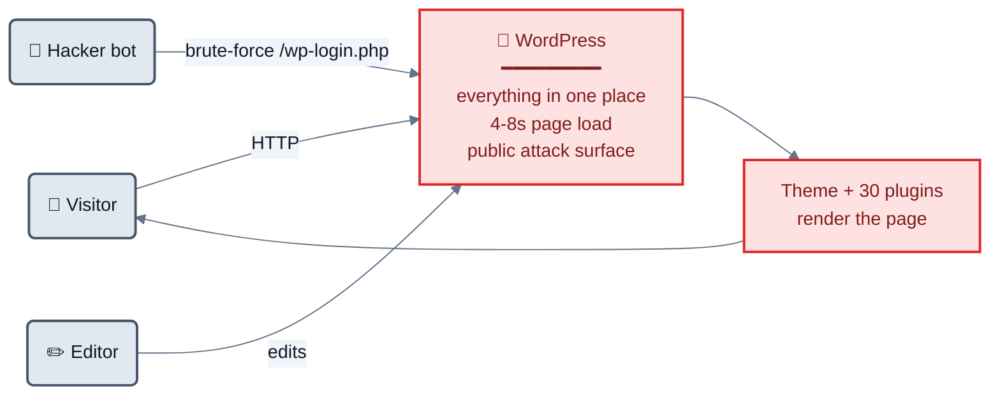
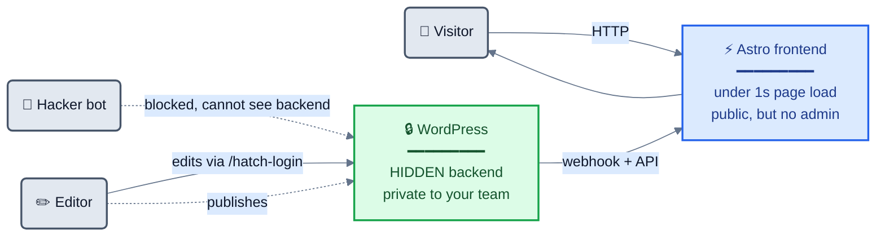
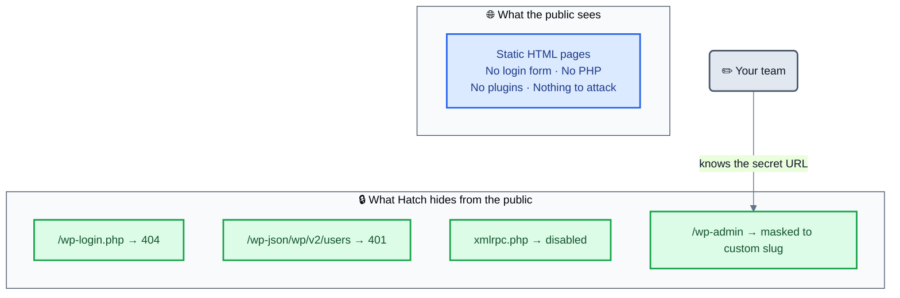
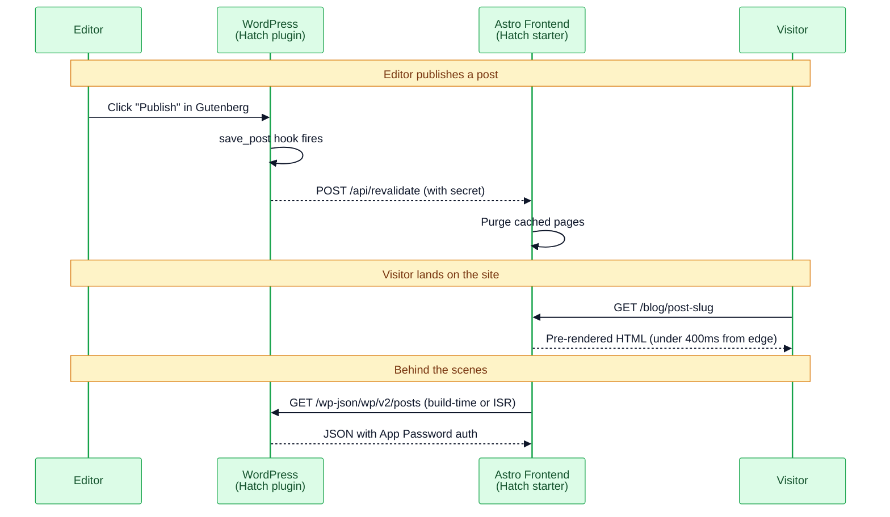

# What is Headless WordPress? (the plain-English version)

> **[← Back to README](../README.md)**

If you're new to headless, this is the page to start on. No jargon, no marketing-speak — just the actual concept with real diagrams.

---

## The restaurant analogy

> **Imagine your WordPress site like a restaurant.**
>
> 🍳 The **kitchen** (WordPress) is where your team prepares everything — writes posts, uploads images, manages SEO.
>
> 🍽️ The **dining room** (your public website) is where visitors actually eat.
>
> Today, the kitchen and dining room are mashed into one room. Every customer walking in can see the kitchen door, knock on it, try to break in. The kitchen also has 22 years of clutter slowing service down.
>
> **Headless WordPress** separates them: the kitchen stays private (only your team has the key), and the dining room is brand new — modern, fast, beautiful, and built differently so it's much harder to attack.

That's it. Same chefs, same recipes, same menu. Different dining room.

---

## Two pictures

### Today — traditional WordPress



The public, your team, AND every hacker bot all hit the same WordPress box. Page load drags. Bots probe `wp-login.php` 24/7. Every plugin is an attack surface.

### With Hatch — headless



Visitors hit a separate static frontend that loads in under 1 second. WordPress lives somewhere else — your team accesses it on a private URL only you know. Bots that probe the old endpoints get 404s and 401s.

---

## Why this is faster

In traditional WordPress, your visitor waits while WordPress assembles the page on every visit:

```
Visitor request → WordPress boot → DB queries (10-50) → plugins run →
theme renders → assemble HTML → maybe cache it → ship to visitor
≈ 3-8 seconds
```

With Hatch, the page is **pre-rendered** and stored on a global edge network:

```
Visitor request → CDN edge serves cached HTML
≈ 150-400ms anywhere in the world
```

That's why Linear, Vercel docs, Stripe docs, and every modern marketing site is built this way. Speed is a competitive advantage now — Google penalizes slow sites in search rankings, and visitors abandon pages that take longer than 3 seconds.

---

## Why this is unhackable (or close to it)

WordPress is the most-attacked CMS on the internet because 43% of all websites run it. Attackers hit:

- `/wp-login.php` — millions of brute-force attempts per day
- `/wp-json/wp/v2/users` — scrapes your team's usernames
- `/xmlrpc.php` — amplifies brute-force attacks
- 30+ active plugins — each with its own vulnerability surface
- Old themes — known holes

With Hatch headless, **the public never sees any of this**:



The frontend is just static HTML — there's nothing to hack. The WordPress backend is hidden behind a custom URL only your team knows. Bots probing the old URLs get 404s. **Hatch automates all of this** in the [Security tab](../README.md#%EF%B8%8F-security) of the WP admin.

---

## "I already run WordPress. Why do I need Hatch?"

Maybe you don't. But if any of these are true, Hatch saves you weeks:

- 😩 Your WordPress site loads in **3–8 seconds** and Google penalizes you
- 🔓 You're tired of `wp-login.php` brute-force attacks and security work
- 🐢 Mobile performance stays bad no matter how many caching plugins you stack
- 🤖 You want to rank in **ChatGPT, Perplexity, Claude** answers, not just Google
- 💸 Your hosting + caching + CDN + security plugin bill keeps growing
- 🎨 You want a modern frontend but every headless tutorial is 30+ hours of plumbing
- 👥 You're not a developer and have been told this needs a senior engineer

---

## The technical flow



---

## So what does Hatch actually DO in this picture?

Hatch is the **WordPress plugin** in those diagrams — the thing that:

1. **Hardens** WordPress so it's hidden from the public
2. **Bridges** your existing plugins (RankMath, Yoast, ACF, WPForms, etc.) so their data flows cleanly to the frontend
3. **Generates** the Application Password your frontend needs
4. **Fires webhooks** to your frontend when content changes
5. **Pushes updates** to your VPS frontend via the Hatch Agent (RunCloud-style daemon)
6. **Provides 8 Gutenberg blocks** that work headlessly with Tailwind output

The frontend half (Astro starter, themes) is separate — you deploy it on Cloudflare, Vercel, Netlify, or your own VPS.

---

## Ready to try?

→ **[Download Hatch v0.5.0](https://github.com/adityaarsharma/hatch/releases/latest/download/hatch.zip)**

Or read the [main README](../README.md) for the full feature list and install instructions.

---

## Related docs

- [Enterprise Readiness](enterprise-readiness.md) — what Hatch needs to graduate from "well-architected" to "production-proven"
- [GraphQL vs REST](graphql-vs-rest.md) — why Hatch uses REST instead of WPGraphQL
- [Edge Cases](edge-cases.md) — 33 documented headless WP gotchas and how Hatch handles them
- [Security](security.md) — the security model in detail
- [Dynamic Content](dynamic-content.md) — how to handle ISR, real-time, forms
